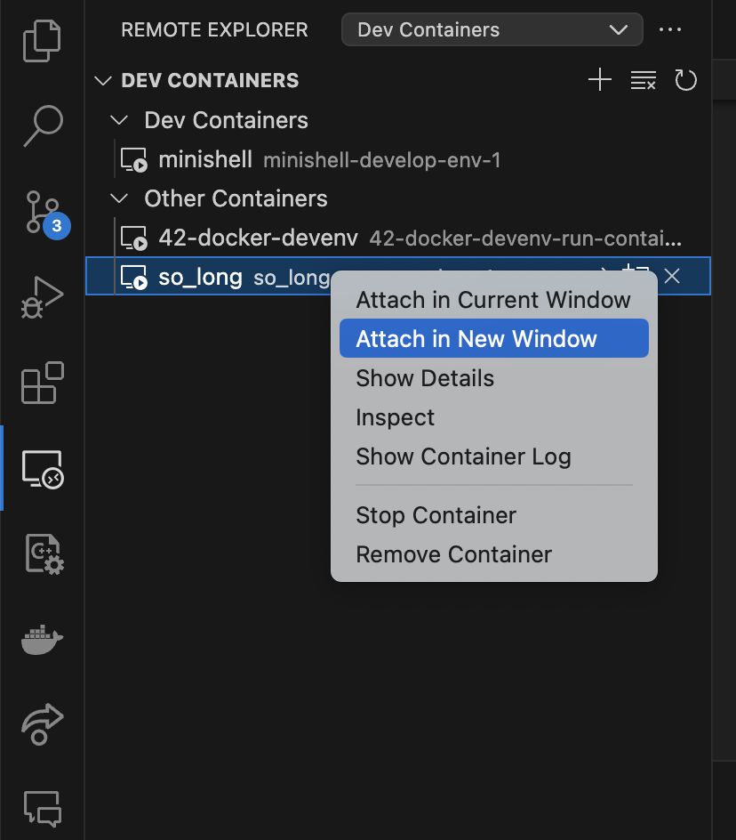

# 42Campus Home Environment

## Description

This repository is created for 42Campus students to have the same environment as in campus PCs. The goal is to make remote work as seamless and productive as possible.

## Installation

### Prerequisites

Before you begin, ensure you have met the following requirements:

- You have installed the latest version of [Docker](https://docs.docker.com/get-docker/)
- Intall vscode plugin:
    * [Remote Explorer](https://marketplace.visualstudio.com/items?itemName=ms-vscode.remote-explorer)
    * [Docker](https://marketplace.visualstudio.com/items?itemName=ms-azuretools.vscode-docker)
    * [Dev-Container](https://marketplace.visualstudio.com/items?itemName=ms-vscode-remote.remote-containers)

### Run-up container
Download related files, build image and run up container:

'''sh
bash -c "$(curl -fsSL https://raw.githubusercontent.com/LeaYeh/42-Docker-DevEnv/master/Dockerfile && curl -fsSL https://raw.githubusercontent.com/LeaYeh/42-Docker-DevEnv/master/docker-compose.yml && curl -fsSL https://raw.githubusercontent.com/LeaYeh/42-Docker-DevEnv/master/run.sh && bash run.sh)"
'''

## Usage

Attech the container to new vscode window.


## Contributing

We welcome contributions from our peers. If you have improvements or features you'd like to add, please follow these steps:

#### Step 1.

Create new feature branch for each feature, the feature develop life cycle should be around hours work.

```
> git checkout -b feat-<NAME>
```

#### Step 2.

After your work, checkout back to the main branch and align with the latest version again. Then checkout to feature branch and rebase with main branch.

```
> git checkout main
> git pull

> git checkout feat-<NAME>
> git rebase main
```

#### Step 2.a

No confiliction happend! Go to the Step 3.

#### Step 2.b

Occur confiliction when rebase...

1. First, git will pause the rebase and allow you to fix the conflict. You can see which files contain conflicts by running git status.

2. Open the file with conflicts. Git marks conflicts in the source code with <<<<<<<, =======, and >>>>>>>. The code between <<<<<<< and ======= is your local changes and the code between ======= and >>>>>>> is the incoming changes. You need to manually edit the file to resolve the conflict.

3. After you've resolved the conflict, you need to add the resolved files to the staging area and continue the rebase process.

```
> git add <filename>
> git rebase --continue
```

#### Step 3

Push the feature branch to the remote repository branch 
PS: Because we use `rebase` to change the history, so it's necessary force push.

```
> git push origin feat-<NAME> --force
```

#### Step 4

Make a pull request and wait for the review and merge by your pear.

## License

Include information about the license, if any.