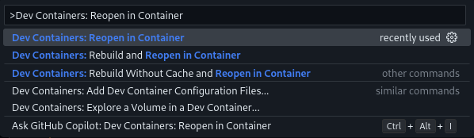
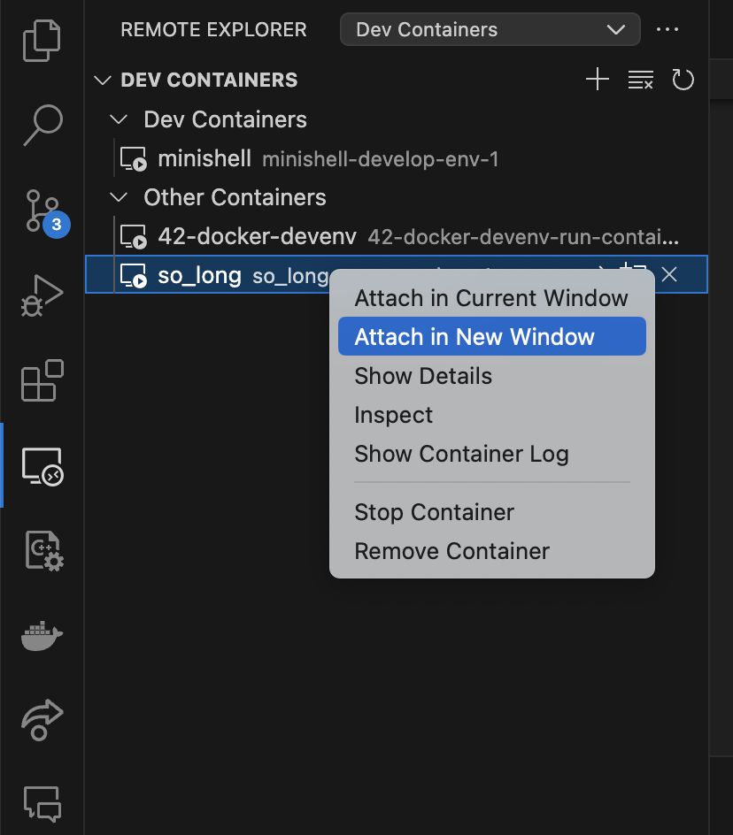

# 42Campus Home Environment

## Description

This repository is created for 42Campus students to have the same environment as in campus PCs. The goal is to make remote work as seamless and productive as possible.

## Prerequisites

Before you begin, ensure you have met the following requirements:

- Install the latest version of [Docker](https://docs.docker.com/get-docker/)
- Install VS Code extensions:
    * [Remote Explorer](https://marketplace.visualstudio.com/items?itemName=ms-vscode.remote-explorer)
    * [Docker](https://marketplace.visualstudio.com/items?itemName=ms-azuretools.vscode-docker)
    * [Dev-Container](https://marketplace.visualstudio.com/items?itemName=ms-vscode-remote.remote-containers)

---

# Option 1: VS Code specific Dev Container

## Installation

1. Make sure you are in the **root** directory of the project you want to run in a container.

2. Download the `.devcontainer` directory into the root of your project with the following command:
   ```sh
   bash -c "$(curl -fsSL https://raw.githubusercontent.com/LeaYeh/42-Docker-DevEnv/master/install.sh)"
   ```

## Usage

Open the Command Palette (`Ctrl+Shift+P`) and select `Dev Containers: Reopen in Container`.


---

# Option 2: Generic Docker Container

## Installation

Download related files, build image and run up container (only need to do this at the first time or Dockerfile update):

```sh
bash -c "$(curl -fsSL https://raw.githubusercontent.com/LeaYeh/42-Docker-DevEnv/master/run.sh)"
```

## Usage

Attach the container to new VS Code window.


---

# Contributing

We welcome contributions from our peers. If you have improvements or features you'd like to add, please follow these steps:

#### Step 1.

Fork and create a new feature branch.

```
> git checkout -b feat-<NAME>
```

#### Step 2.

After your work, checkout back to the main branch and update to the latest version again. Then checkout to the feature branch and rebase with main branch.

```
> git checkout main
> git pull

> git checkout feat-<NAME>
> git rebase main
```

#### Step 2.a

No conflicts happened! Go to the Step 3.

#### Step 2.b

Conflicts occured when rebasing...

1. First, git will pause the rebase and allow you to fix the conflict. You can see which files contain conflicts by running `git status`.

2. Open the file with conflicts. Git marks conflicts in the source code with `<<<<<<<`, `=======`, and `>>>>>>>`. The code between `<<<<<<<` and `=======` are your local changes and the code between `=======` and `>>>>>>>` are the incoming changes. You need to manually edit the file to resolve the conflict.

3. After you've resolved the conflict, you need to add the resolved files to the staging area and continue the rebase process.

```
> git add <filename>
> git rebase --continue
```

#### Step 3

Push the feature branch to the remote repository branch.
PS: Because we use `rebase` to change the history, it's necessary to force push.

```
> git push origin feat-<NAME> --force
```

#### Step 4

Make a pull request on GitHub and wait for the review.
